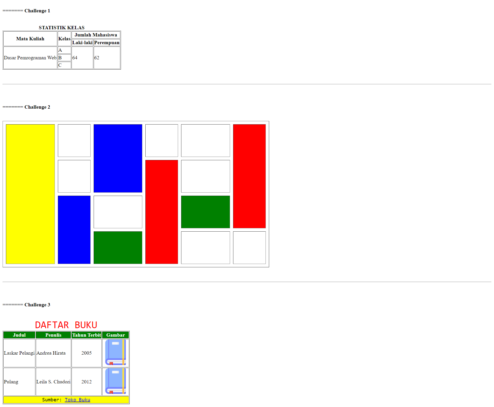
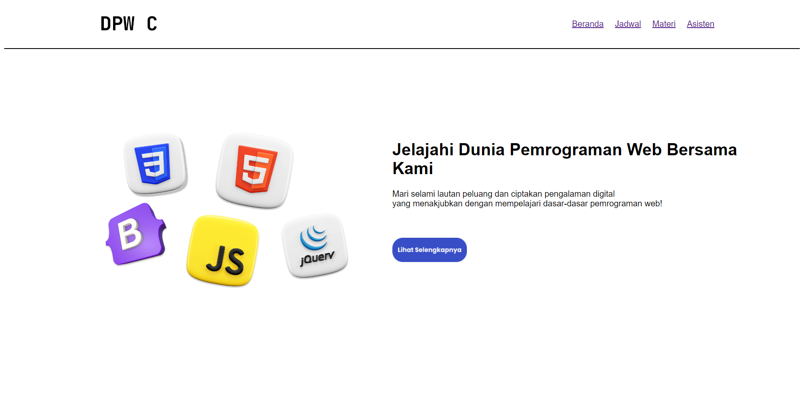

# PRAKTIKUM DASAR DASAR PEMROGRAMAN WEB
Selamat datang di repositori praktikum dasar dasar pemrograman web.

Repositori ini dibuat untuk menyimpan hasil praktikum per pertemuan dalam praktikum dasar dasar pemrograman web C. Tujuan repositori ini adalah untuk memberikan sumber daya kepada praktikan agar mereka dapat melihat contoh kode dan hasil praktikum per pertemuan.

## PERTEMUAN PERTAMA - HTML DASAR

### Pembahasan
pada pertemuan pertama kita membahas :
1. Elemen HTML
2. Struktur Dasar
3. Heading text
4. Paragraph
5. Blockquote
6. Font Style
7. Baris dan Garis
8. Image
9. Link
10. Unordered List
11. Ordered List
12. Semantic Syntax
13. Block & Inline
14. Tag Meta

by febrianu

### Code : berada di folder pertemuan1 dan file index.html
### hasil running

## PERTEMUAN PERTAMA - HTML DASAR

### Pembahasan
pada pertemuan pertama kita membahas :
1. Struktur Tabel
2. Border dan Caption
3. Tabel Header
4. Pengelompokkan Tabel (Thead, Tbody, Tfoot)
5. Penggabungan Sel (Rowspan, Colspan)
6. Styling Table Wuthout CSS
7. Challenge 1,2,3

by faqih

### Code : berada di folder pertemuan1 dan file index.html
### hasil running materi

### hasil running challenge

### hasil running layouting web dengan tabel

