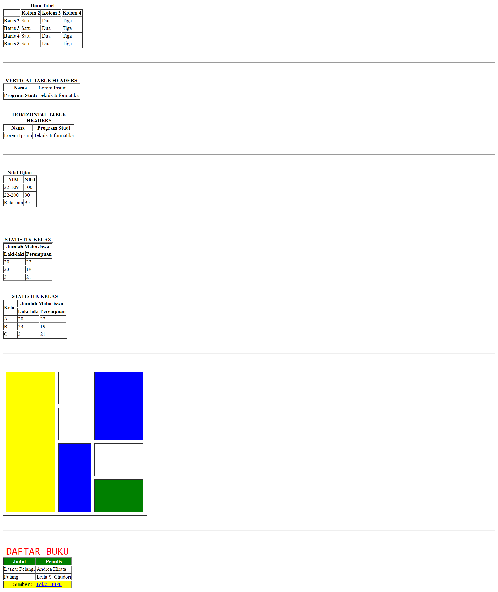
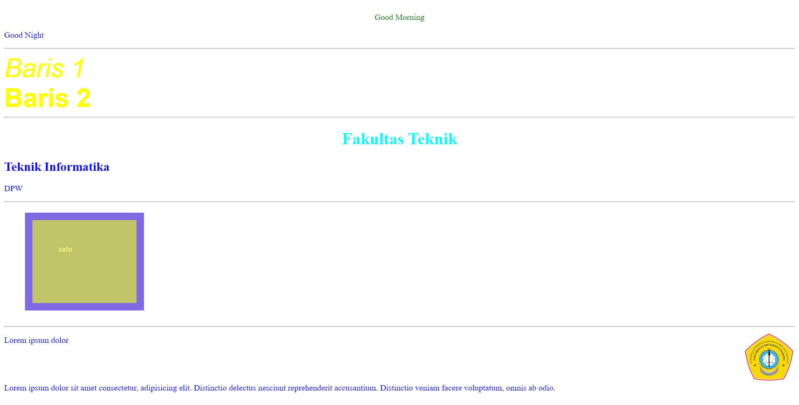
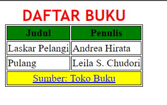
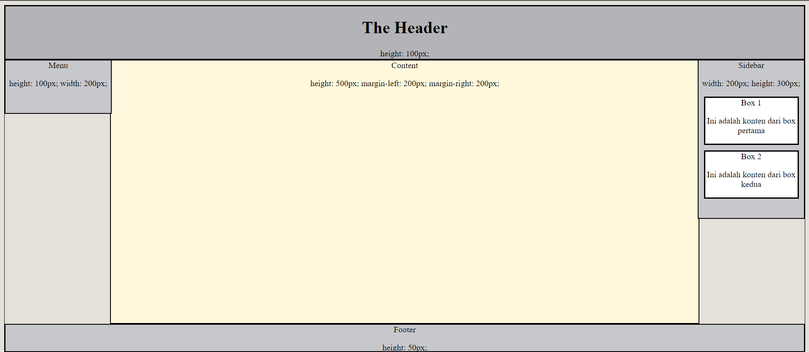

# PRAKTIKUM DASAR DASAR PEMROGRAMAN WEB
Selamat datang di repositori praktikum dasar dasar pemrograman web.

Repositori ini dibuat untuk menyimpan hasil praktikum per pertemuan dalam praktikum dasar dasar pemrograman web C. Tujuan repositori ini adalah untuk memberikan sumber daya kepada praktikan agar mereka dapat melihat contoh kode dan hasil praktikum per pertemuan.

## PERTEMUAN KEDUA - HTML DASAR

### Pembahasan
pada pertemuan kedua kita membahas :
1. Elemen HTML
2. Struktur Dasar
3. Heading text
4. Paragraph
5. Blockquote
6. Font Style
7. Baris dan Garis
8. Image
9. Link
10. Unordered List
11. Ordered List
12. Semantic Syntax
13. Block & Inline
14. Tag Meta

by febrianu

### Code : berada di folder pertemuan2-html-dasar dan file index.html
### hasil running

## PERTEMUAN KETIGA- HTML TABLE

### Pembahasan
pada pertemuan ketiga kita membahas :
1. Struktur Tabel
2. Border dan Caption
3. Tabel Header
4. Pengelompokkan Tabel (Thead, Tbody, Tfoot)
5. Penggabungan Sel (Rowspan, Colspan)
6. Styling Table Wuthout CSS
7. Challenge 1,2,**3**

by faqih

### Code : berada di folder pertemuan3-html-table
### hasil running materi

### hasil running challenge

### hasil running layouting web dengan tabel
   

## PERTEMUAN KELIMA- CSS dasar dan Layouting

### Pembahasan
pada pertemuan kelima kita membahas :
1. Syntax CSS dan Selector
2. Property CSS
3. Penggunaan CSS (inline/internal/external)
4. CSS Box Model
5. Layouting Halaman

by febi

### Code : berada di folder pertemuan5-css
### hasil running materi

### hasil running ch1

### hasil running lch2

